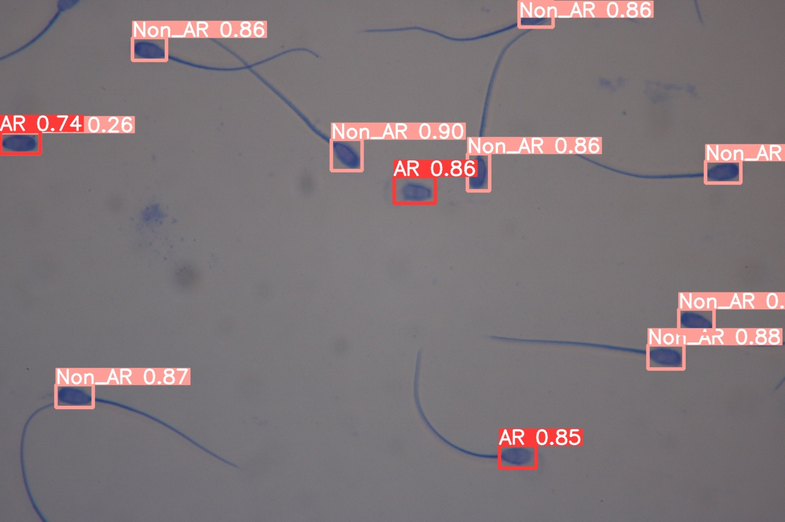
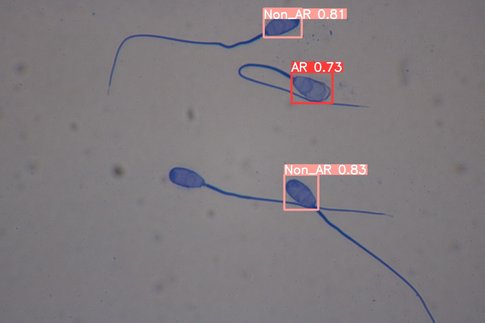
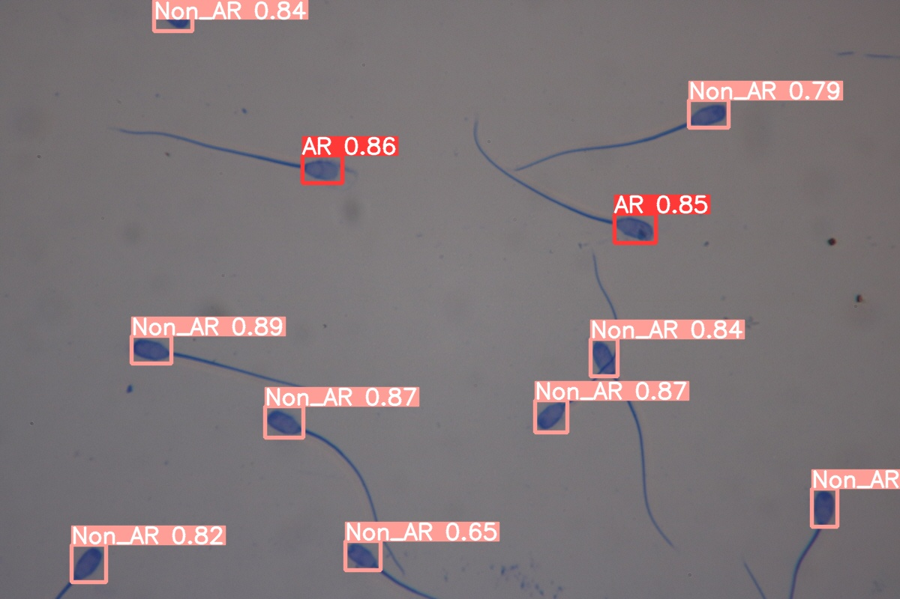
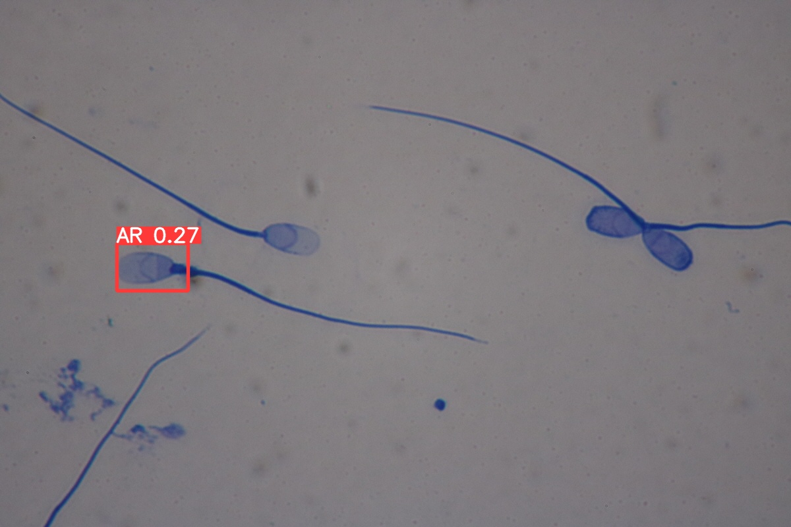
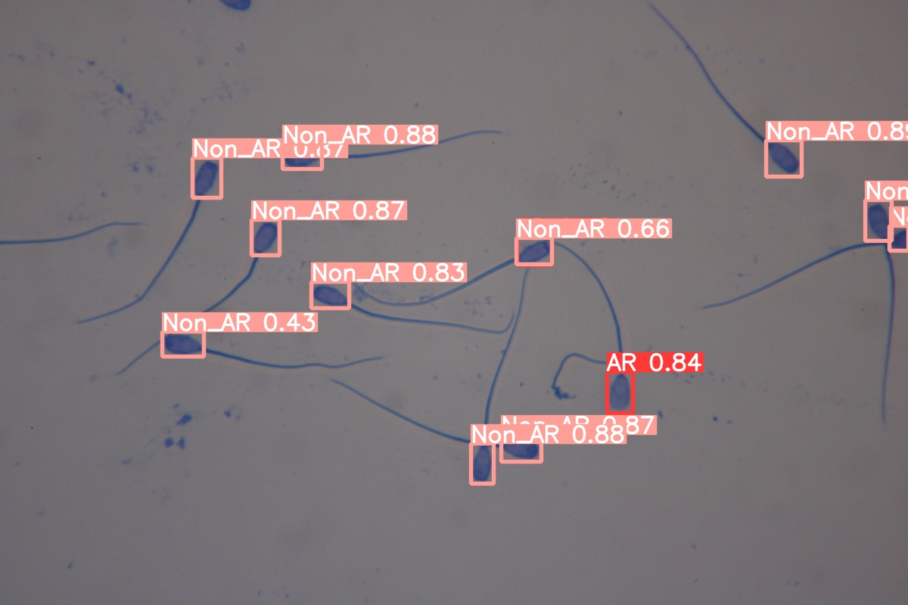
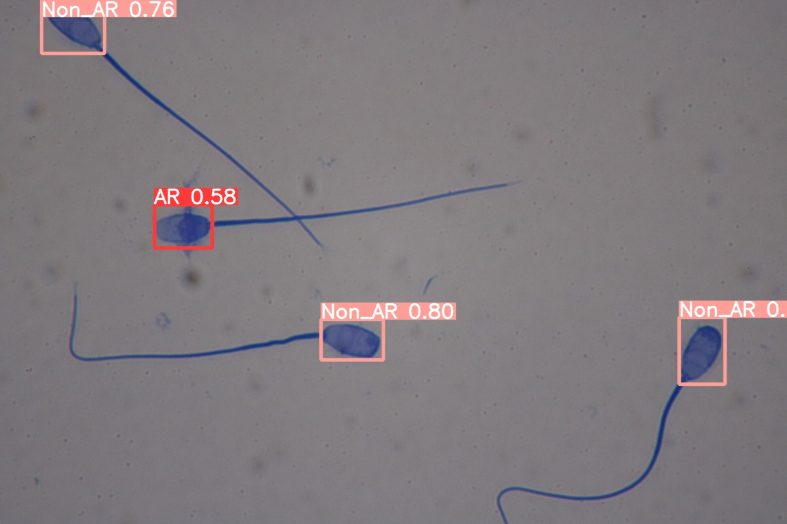
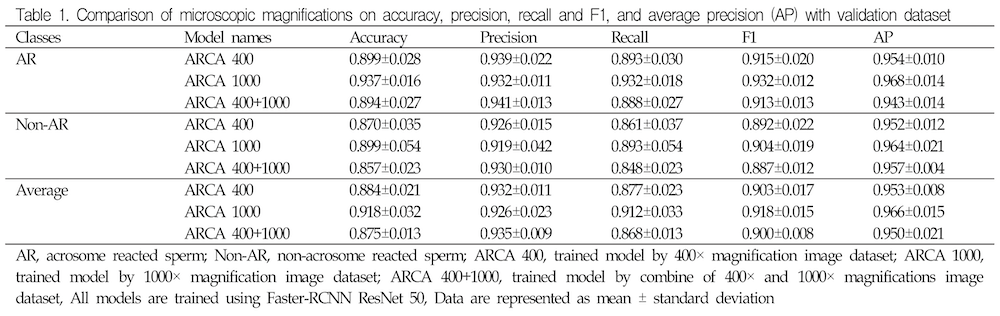
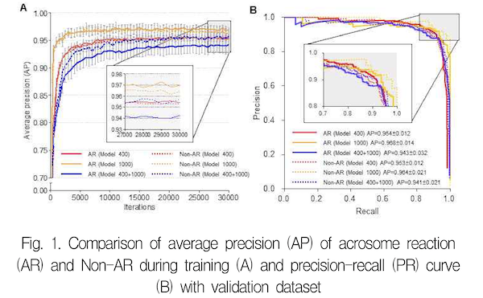
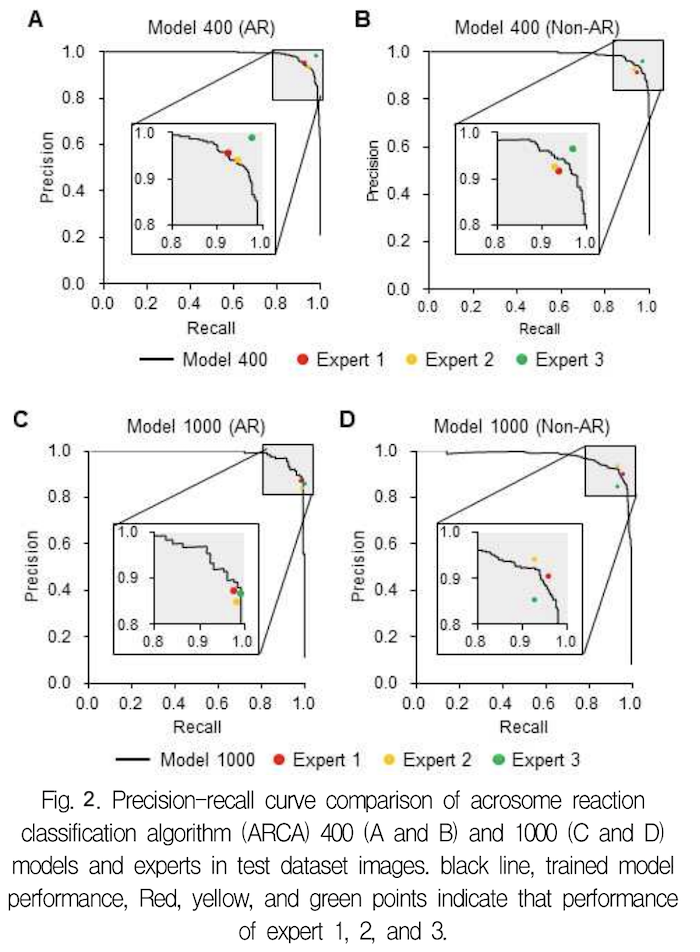
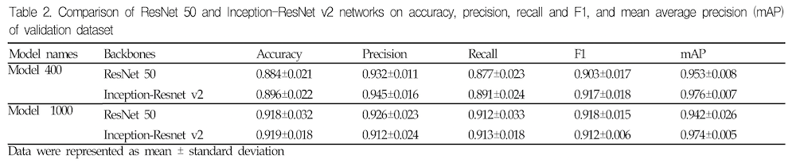

# object_detection_acrosome
Object detecting of acrosome reaction (AR) status according to micro plasma membrane (PM) in sperm images with diverse magnification.

  

## INTRODUCTION

 Sperm morphological analysis is widely used for therapy of infertility which are applied to select superior breeding in reproductive biomedical field. The sperm head is covered with plasma membrane (PM) and contains acrosome and nucleus. This special structure is distinguished from other somatic cells such as epithelial and fibroblast. Especially, the PM not only play a role to protect organelles from outside environment, but also the protect acrosome from external factors in sperm. In addition, flexibility of PM is changed to release acrosome during fertilization process because the acrosome contains many enzymes to penetrate cumulus oocyte complexes. 

## DATA
* Images : 653
* Image size : 1200x800 px
* Entity : 10 pigs
* Magnificiant mode : 400x-215 images and 1000x-438 images
* Class : 2 (AR(Acrosome Reaction) and Non-AR)
* Annotation : 400x; 2,732 AR + 1,741 Non-AR
               1000x; 2,385 AR + 996 Non-AR
* Data Split : train (80%) and test (20%)
               mode = random

## DEPENDENCY SPECIFICATION
* TensorFlow 1.14.0
* Python 3.7.4
* Faster-RCNN
* ResNet 50
* Inception-ResNet v2

## RESULT
|  |400x           |1000x           |
|--|---------------|----------------|
|1 |||
|2 |||
|3 |||

↑ Visible results of trained model on test dataset  
 

  
 

  

 Model 1000 (Fig.1A, yellow lines) are higher than other models. Of these, Non-AR sperm (Fig.1A, yellow line) is higher than AR sperm (Fig.1A, yellow dot line). Otherwise, AR sperm of model 400+1000 (Fig.1A, blue line) is lowest in sperms of other models. The precision-recall curves of 2 sperm types (AR and Non-AR) when IoU is 0.5, are shown in Fig.1B. The APs of AR sperm (Fig.1B, yellow line) in model 1000 are higher than model 400 (Fig.1B, red line) and model 400+1000 (Fig.1B, blue line) models. 

  

 After confirmation of performances regarding ResNet 50 and Inception-ResNet v2 based on evaluation of test dataset in model 400 and 1000, we select Inception-Resnet v2 backbone of model 400 and 1000 for comparing with experts. Classification performance of model 400 (Fig.2A, black line) is similar expert 1 (Fig.2A, red point) and 2 (Fig.2A, yellow point), but lower expert 3 (Fig.2A, green point) in AR sperm detection. On the other hand, model 400 (Fig.2B, black line) classify Non-AR sperm more than expert 1 (Fig.2B, red point) and 2 (Fig.2B, yellow point). Performance of AR sperm detection in model 1000 (Fig.2C, black line) is higher than expert 1 (Fig.2B, red point) and 2 (Fig.2B, yellow point) 

 

  

## FUTURE WORK
* Change annotation methodology (edge)
* [Analyze sperm motility](https://github.com/boguss1225/sperm_motility_analyzer)

## PAPER
[Deep learning based automatic acrosome reaction
classification system in sperm](https://manuscriptlink-society-file.s3-ap-northeast-1.amazonaws.com/sma/conference/sma2020fall/presentation/12.pdf)

## ACKNOWLEDGEMENTS
This study was supported by National Research Foundation of Korea (NRF 2019R1I1A1A01060932), Republic of Korea

## RELATED WORK
* https://github.com/boguss1225/object_detection_morphology
* https://github.com/boguss1225/Iris-Segmentation-Keras
